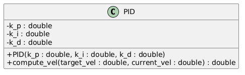

# Acme Robotics PID Controller Project

# C++ Acme Robotics PID Badges
 [](https://codecov.io/gh/rahulk-99/AcmeRoboticsPID-Part1) [](LICENSE)

---
## Part 1 Authors
* **Driver:** Rahul Kumar (`rahulk-99`)
* **Navigator:** Venkata Madhav Tadavarthi (`madhav2133`)

## Part 2 Author
* **Driver & Navigator:** Marcus William Hurt (`mdevhurt1`)

## Overview

This project implements a PID (Proportional-Integral-Derivative) controller for Acme Robotics' mobile robot platform. The controller is designed to provide precise velocity control through feedback mechanisms.

### UML Design


### Project Structure
The project uses:
- CMake for build management
- GoogleTest for unit testing
- Doxygen for documentation

### Basic Installation and Setup
```bash
# Clone the repository
git clone https://github.com/rahulk-99/AcmeRoboticsPID-Part1.git
cd AcmeRoboticsPID-Part1

# Configure and build the project
cmake -S ./ -B build/
cmake --build build/

```

### Implementation
The PID controller implementation consists of:
- Header (`include/pid.hpp`): Class declaration with gains (kp, ki, kd)
- Source (`app/pid.cpp`): Stub implementation returning constant value

To run the implementation:
```bash
./build/app/shell-app
```

### Testing
The project includes unit tests for the PID controller in `test/pid_test.cpp`:
- Stub implementation verification
- Constructor initialization test
- Edge cases testing (zero, large, negative velocities)

To run the tests:
```bash
./build/test/cpp-test
```


## How to use GitHub CI to upload coverage report to Codecov

### First, sign up Codecov with you GitHub account.

  https://about.codecov.io/sign-up/

### Configure the repository you want to upload from

After you sign in, you should see a list of your
repositories. Configure the one you want to receive coverage data
from.

In the confiuration screen, scroll down to "**Step 2: add repository
token as repository secret**"

You should see a pre-generated repository secrete like below:

  "CODECOV_TOKEN"    "fb85d2f0-8db8-48cc-9e8e-9681d51fd9c4"  <--- **this is just an example**

Now, click on the **"repository secret"** link, which takes you back to
your GitHub account, and add the above as a New Secret:  **(your Secret # is different)**

   - Name = CODECOV_TOKEN

   - Secret = fb85d2f0-8db8-48cc-9e8e-9681d51fd9c4

Click the "Add secret" button.


### Create a GitHub CI yaml file

See below for the setup of this repo:

https://github.com/TommyChangUMD/cpp-boilerplate-v2/blob/main/.github/workflows/run-unit-test-and-upload-codecov.yml

### Add your Codecov and GitHub CI badge to README.md

Follow the instruction below to copy the badge (in markdown format)
and paste it at the top of your README.md file.

For example:
#### CICD Workflow status

https://docs.github.com/en/actions/monitoring-and-troubleshooting-workflows/adding-a-workflow-status-badge

For example,

To generate the CICD badge for this particular repo, I put the line below in this README.md file:
``` markdown

```


#### Code Coverage Report
https://docs.codecov.com/docs/status-badges

For example, to generate the Code Coverage badge for this particular repo,  I put the line below in this README.md file:
``` markdown
[](https://codecov.io/gh/TommyChangUMD/cpp-boilerplate-v2)
```

[](https://codecov.io/gh/TommyChangUMD/cpp-boilerplate-v2)


Note: When you click on the codecov badge, you should see the coverage
report.  You should also see the source file listing.  If not, you may
need to login your codecov account first.

